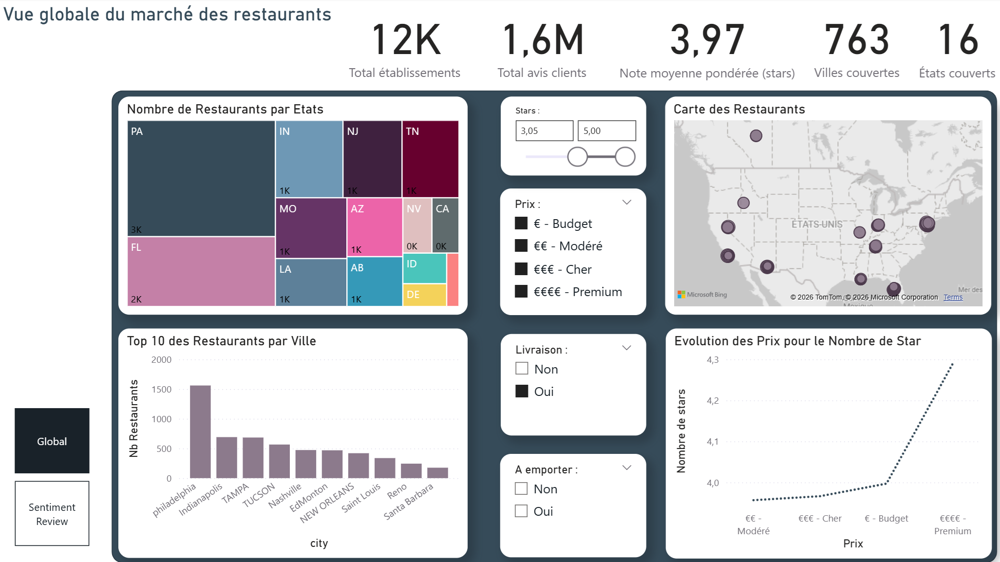

# 🍽️ Restaurant Performance Intelligence  
## Outil d’aide à la décision stratégique pour investisseurs et groupes de restauration

---

## 📌 Executive Summary

Ouvrir un restaurant représente un investissement à fort risque et à forte intensité capitalistique.

Ce projet transforme les données Yelp en un **outil stratégique d’aide à la décision**, permettant d’évaluer le potentiel de performance d’un restaurant avant son ouverture.

🎯 Objectif : réduire le risque d’investissement et maximiser la probabilité de succès grâce à une approche data-driven.

---

# 💼 Problématique Business

Avant d’ouvrir un établissement, plusieurs questions stratégiques se posent :

- 📍 Quelle localisation offre le meilleur potentiel ?
- 💰 Quelle gamme de prix adopter ?
- 🍽 Quel type de cuisine performe le mieux dans la zone ciblée ?
- 🚚 Les services additionnels (livraison / à emporter) influencent-ils la note ?
- ⭐ Quelle note peut-on anticiper ?

Ce projet apporte des réponses basées sur l’analyse de données réelles.

---

# 🧠 Solution Développée

La solution repose sur trois piliers complémentaires :

## 1️⃣ Analyse du Marché (Power BI)

- Répartition des restaurants par État et ville
- Densité concurrentielle
- Corrélation gamme de prix ↔ note moyenne
- Analyse des services (livraison / à emporter)

## 2️⃣ Analyse du Sentiment Client

- Corrélation entre sentiment des avis et note finale
- Comparaison TOP vs FLOP restaurants
- Impact réputationnel mesurable

## 3️⃣ Modèle Prédictif

Un modèle de Machine Learning permettant de :

- Simuler un futur restaurant
- Intégrer la localisation, la catégorie, le prix et les services
- Pondérer la crédibilité via le nombre d’avis
- Fournir une **note prédictive sur 5**

---

# 📊 KPIs Stratégiques

| KPI | Impact Business |
|------|----------------|
| ⭐ Note Moyenne Pondérée | Indicateur global de performance |
| 💬 Score de Sentiment | Qualité perçue & réputation |
| 📍 Densité Concurrentielle | Intensité du marché |
| 💰 Prix vs Note | Positionnement stratégique |
| 🚚 Services additionnels | Levier d’optimisation |

---

# 🔎 Insights Stratégiques

- Les établissements premium obtiennent en moyenne de meilleures notes.
- Le volume d’avis stabilise et renforce la crédibilité d’un restaurant.
- Les zones à forte demande ne sont pas systématiquement les plus rentables.
- Le sentiment client est fortement corrélé aux notes 4–5 ⭐.
- L’expérience client constitue un levier stratégique mesurable.

---

# 🏗 Architecture Data & Modélisation

## Préparation des données
- Nettoyage du dataset Yelp
- Feature engineering
- Encodage des variables catégorielles
- Sélection des variables explicatives

## Machine Learning
- Standardisation des données
- Régression Linéaire
- Pondération par nombre d’avis
- Export du modèle au format `.pkl`

## Application
- Interface interactive via Streamlit
- Simulation en temps réel
- Carte concurrentielle locale (OpenStreetMap)

---

# 🛠 Stack Technologique

- Python
- Pandas
- Scikit-learn
- Streamlit
- Power BI
- OpenStreetMap API
- Git / GitHub

---

# 📊 Dashboard – Vision Décisionnelle

### Page 1 — Analyse Marché
- Taille et structure du marché
- Répartition géographique
- Impact du positionnement prix

### Page 2 — Performance & Sentiment
- Distribution des notes
- Impact du sentiment
- Analyse TOP vs FLOP

---

# 🎯 Cas d’Usage

✔ Étude de faisabilité avant ouverture  
✔ Benchmark concurrentiel  
✔ Optimisation du positionnement  
✔ Support stratégique pour investisseurs  
✔ Aide à la décision pour franchisés  

---

# 🚀 Valeur Ajoutée

Ce projet démontre la capacité à :

- Transformer un dataset brut en outil décisionnel
- Construire des KPIs actionnables
- Développer un modèle prédictif interprétable
- Déployer une application exploitable
- Traduire l’analyse data en recommandations business

---

# 📂 Structure du Projet

restaurant-performance-intelligence/
│
├── app/
│ ├── 1_Prédiction.py
│ ├── 2_Carte_restaurants.py
│ ├── mon_modele.pkl
│ └── dataset.csv
│
├── dashboard/
│ ├── global.png
│ └── sentiment.png
│
├── requirements.txt
└── README.md

# 📥 Source des Données

Données issues du dataset public Yelp Open Dataset.

Les fichiers bruts ne sont pas inclus pour des raisons de volumétrie.

---

# 👤 Auteur

Roman GOURDON  
Projet Portfolio – Data Analyst  

Restaurant Performance Intelligence  
Outil d’aide à la décision stratégique